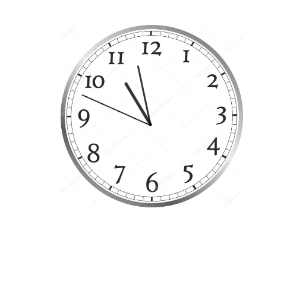
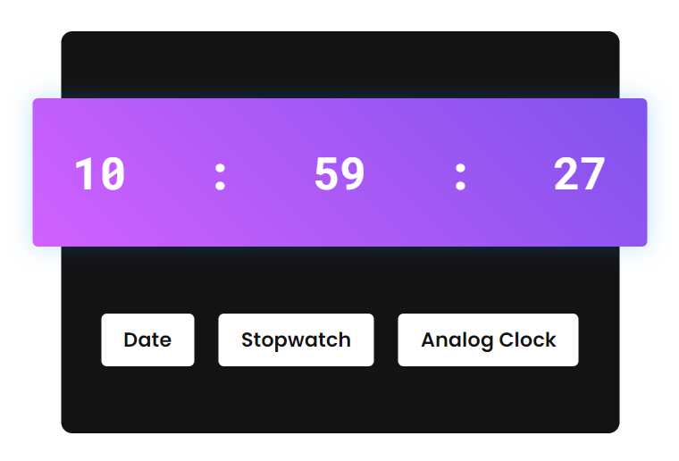
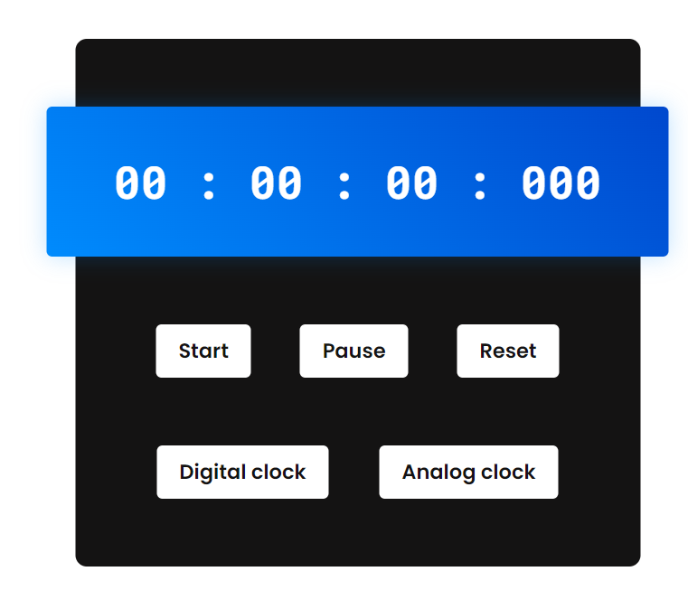

# Clock Project

This project implements three types of clocks: an **Analog Clock**, a **Digital Clock**, and a **Stopwatch**. It is built using HTML, CSS, and JavaScript.

## Features

- **Analog Clock**: A traditional clock with hour, minute, and second hands that moves smoothly to represent the current time.
- **Digital Clock**: A digital representation of the current time, formatted in hours, minutes, and seconds.
- **Stopwatch**: A timer that can be started, stopped, and reset. It shows elapsed time in hours, minutes, seconds, and milliseconds.

## Demo





## Technologies Used

- **HTML5**: Used to structure the web page elements.
- **CSS3**: Used for styling the clock components and animations for the hands of the analog clock.
- **JavaScript (ES6)**: Handles the logic for updating the clock in real-time, stopwatch functionality, and DOM manipulation.

## Installation

To run this project locally:

1. Clone the repository:
   ```bash
   git clone https://github.com/Dutta2005/clock-project.git
